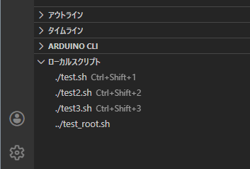

# Local Task Runner

[日本語版 README](./READM.ja.md)

Local Task Runner is a JavaScript-only VS Code extension that discovers executable scripts near the active file and runs them from a sidebar.

## Screenshot



## Current status

This repository now includes publication-ready base files and a working implementation.

## Behavior

- Scans the active file directory and parent directories up to the workspace root.
- Scans direct directory contents only (no recursive scan).
- Filters scripts by OS:
  - Windows: `.bat`, `.cmd`, `.ps1`
  - macOS / Linux: `.sh`
- Sorts scripts by filename (ascending).
- Executes scripts as VS Code tasks with shared terminal output.
- Uses PowerShell for `.ps1`:
  - `powershell.exe -NoProfile -NonInteractive -ExecutionPolicy Bypass -File <scriptPath>`
- No confirmation dialog.
- No custom settings.
- No dedicated log channel.
- Localization metadata:
  - `en` (default), `ja`, `zh`, `fr`, `de`, `es`

## Keybindings

Keybindings apply with:

`editorTextFocus && isWorkspaceTrusted && !terminalFocus`

- `Ctrl+Shift+1` ... `Ctrl+Shift+9`: Run the 1st to 9th script from the current directory group (`./`).

## Security

If the workspace is not trusted, script execution is blocked.

## Development

```bash
npm install
```

Then open this folder in VS Code and run the extension host (`F5`).

## Repository

https://github.com/tanakamasayuki/vscode-local-task-runner
